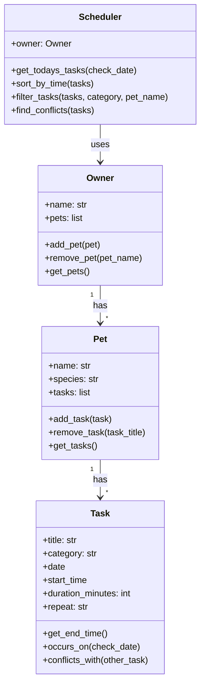

```mermaid
classDiagram
    class Owner {
        +name: str
        +pets: list
        +add_pet(pet)
        +remove_pet(pet_name)
        +get_pets()
    }

    class Pet {
        +name: str
        +species: str
        +tasks: list
        +add_task(task)
        +remove_task(task_title)
        +get_tasks()
    }

    class Task {
        +title: str
        +category: str
        +date
        +start_time
        +duration_minutes: int
        +repeat: str
        +get_end_time()
        +occurs_on(check_date)
        +conflicts_with(other_task)
    }

    class Scheduler {
        +owner: Owner
        +get_todays_tasks(check_date)
        +sort_by_time(tasks)
        +filter_tasks(tasks, category, pet_name)
        +find_conflicts(tasks)
    }

    Owner "1" --> "*" Pet : has
    Pet "1" --> "*" Task : has
    Scheduler --> Owner : uses

```